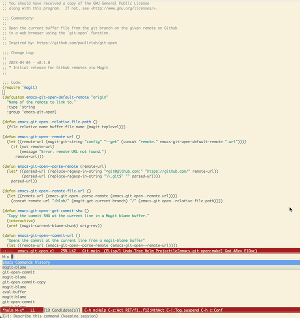

# emacs-git-open

Emacs package to open a file on a git remote. Inspired by [git-open](https://github.com/paulirish/git-open)

## Usage

From the current buffer, call the function to open file on remote to open in browser:

```el
M-x git-open
```

To simply copy the remote file path to clipboard, call:

```el
M-x git-open-copy
```

Both `git-open` and `git-open-copy` will open the file by default, but if a region is
selected, then that range of lines will be highlighted on the remote.


`emacs-git-open` similarly allows you to open the current commit from a `magit-blame` buffer:

```el
M-x git-open-commit
```



### Todo
- Support remote targets other than 'origin'
- Support other git hosting services (gitlab, bitbucket etc.)
- Tests
- Packaging for MELPA
